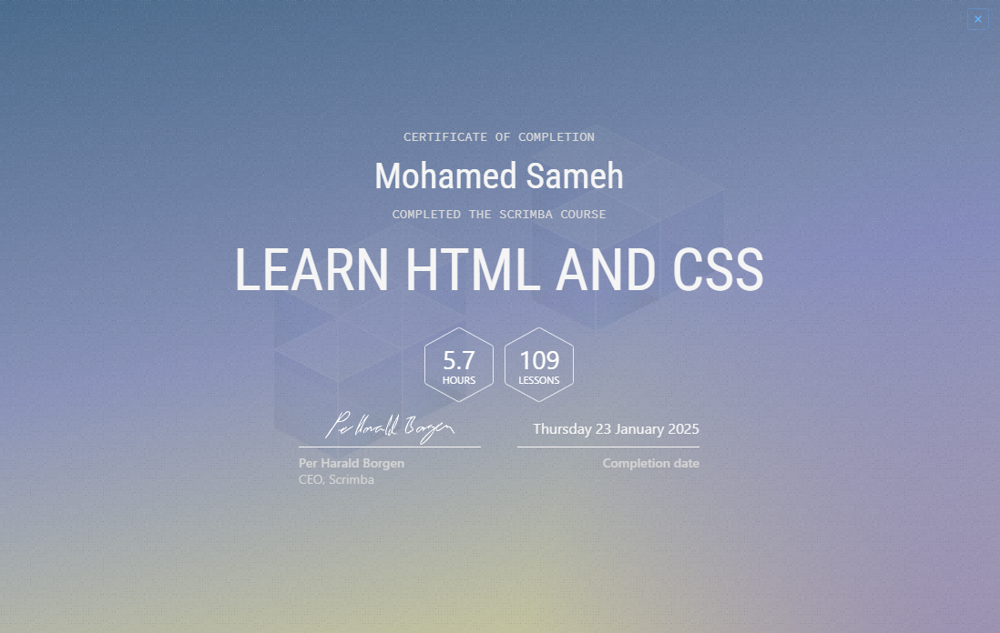
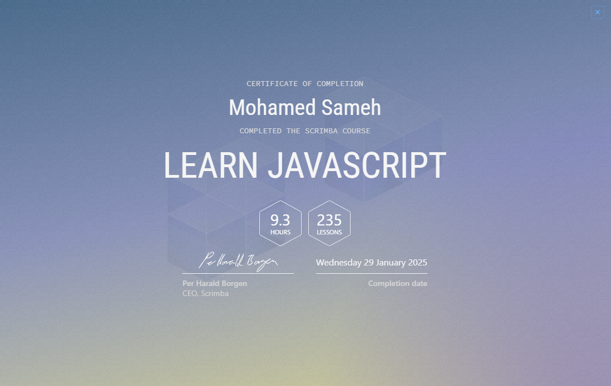
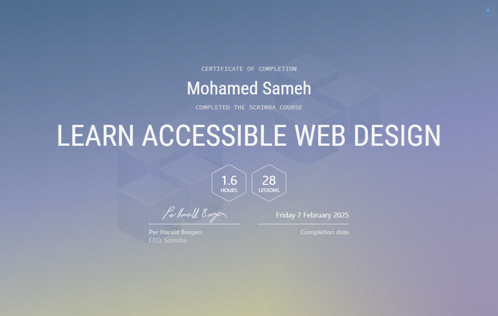
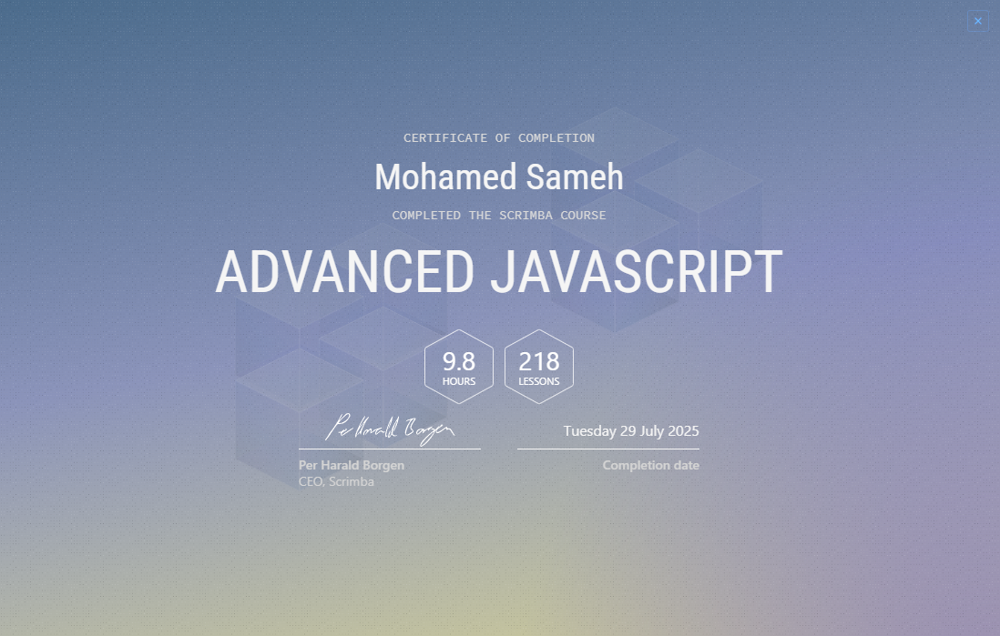
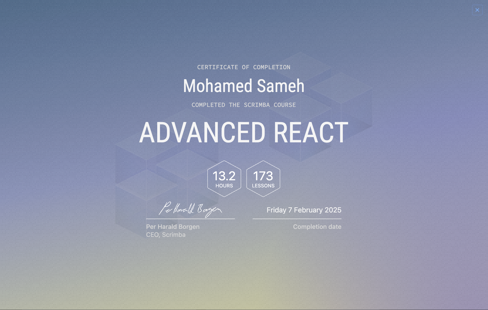
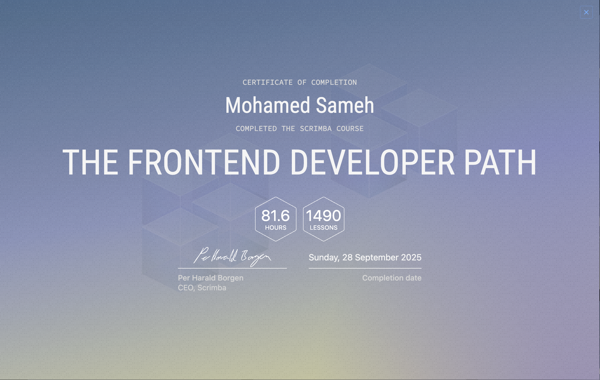

# 📃 About This Repository:

Welcome to the foundational projects repository for Scrimba! This repository serves as a collection of all the hands-on projects completed during various Scrimba courses, providing a comprehensive showcase of the skills and knowledge gained throughout the learning journey. Each project is neatly organized into its own folder, with the folder name reflecting the specific course it was derived from.

## 🚁 Learn HTML & CSS (✅ Completed on 23rd January, 2025): 

Started on the 20th of December, this course was taken to brush up on the fundamentals of HTML and CSS, serving as a strong foundation for more advanced learning. By revisiting essential concepts, the goal was to ensure a solid grasp of these core web technologies, paving the way for a smoother transition into the Learn JavaScript course. This journey represents an important step toward mastering front-end development and eventually learning React, which will enable the creation of dynamic, modern web interfaces. While the primary focus is on web development, there is also a possibility of branching into app development in the future.

## Certificate
[](https://scrimba.com/learn-html-and-css-c0p)


## 🧠 Learn JavaScript (✅ Completed on 29th January, 2025):

Started on the 24th of January, this course introduces fundamental programming concepts like conditionals, loops, methods, and object-oriented programming (OOP). This course is an exciting step in learning JavaScript, focusing on problem-solving, bug fixing, and foundational techniques for building dynamic applications. Progress includes completing several interactive projects, such as a password generator, Blackjack game, and randomized emoji picker. These projects not only solidify understanding of core JavaScript concepts but also emphasize practical application, helping to build confidence in coding independently. As the journey unfolds, this course aims to lay the groundwork for becoming proficient in JavaScript, with the ultimate goal of transitioning to more advanced frameworks like React and beyond. 🚀

## Certificate
[](https://scrimba.com/learn-javascript-c0v)

## 🧑‍🏫 Learn Accessible Web Development (✅ Completed on 7th Feb, 2025):
This course focused on making websites accessible to all users, ensuring that websites can be used by people with disabilities. Topics covered include keyboard navigation, screen reader compatibility, and designing with accessibility in mind. By completing this course, I gained a deeper understanding of how to create websites that are inclusive and provide an equal experience to all users, regardless of their abilities.

## Certificate
[](https://scrimba.com/learn-accessible-web-design-c031)

## 🧪 Intro to UI Design Fundementals (✅ Completed on 7th July, 2025):
Earned on the 7th of July, this course covered seven essential principles that form the foundation of effective user interface design: white space (strategic use of empty space to create breathing room and guide user attention), color (understanding color theory and psychology in digital interfaces), contrast (creating sufficient visual distinction for readability and accessibility), scale (using size relationships to establish hierarchy and emphasis), alignment (organizing elements in a structured manner to create visual order), typography (selecting and implementing fonts effectively for both aesthetics and user experience), and visual hierarchy (structuring information to guide users through content in order of importance). These seven fundamentals work together to create cohesive, user-friendly interfaces that are both functional and visually appealing.

## Certificate
[](https://scrimba.com/intro-to-ui-design-fundamentals-c0q) 

## ⚙️ Advanced JavaScript (✅ Completed on 29th July, 2025):
Completed on the 29th of July, this course offered a deep dive into core and advanced JavaScript concepts critical for writing clean, efficient, and scalable code. It began with an expanded understanding of array methods such as .map(), .forEach(), and others, alongside refined use of object destructuring to simplify code structure. The course also clarified distinctions between function expressions, inline functions, and arrow functions - especially how they influence the this keyword in different contexts - and introduced default parameters and fallback patterns to write more defensive code.

A significant focus was placed on asynchronous JavaScript, explaining how to overcome callback hell using Promises and async/await syntax. Object-oriented programming principles were reinforced through the creation of custom objects using constructors and ES6 classes, including inheritance, polymorphism, and the use of private fields for encapsulation.

The course also introduced powerful intermediate concepts such as closures, Immediately Invoked Function Expressions (IIFEs), and functional techniques like currying, debouncing, and throttling. It concluded with a focus on generators and recursion, showcasing how these patterns can be used to solve complex problems elegantly and efficiently.

[](https://scrimba.com/advanced-javascript-c03kpi3kss)

## ⚙️ Advanced React (✅ Completed on 7th February, 2025): 
Completed on the 7th of February, this comprehensive course provided an in-depth exploration of advanced React concepts essential for building scalable, performant, and maintainable applications. The curriculum was structured into three core sections, each targeting critical aspects of modern React development. 

### 🔄 Reusability
This section focused on writing DRY (Don't Repeat Yourself) code through custom hooks and component composition. Topics covered included:
- **Custom Hooks**: Creating reusable stateful logic that can be shared across multiple components
- **Component Abstraction**: Designing flexible, reusable components with proper prop interfaces
- **Higher-Order Components (HOCs)**: Understanding composition patterns for cross-cutting concerns
- **Render Props Pattern**: Implementing flexible component APIs for sharing code between components

```jsx
// Example: Custom Hook for API data fetching
const useApiData = (url) => {
  const [data, setData] = useState(null);
  const [loading, setLoading] = useState(true);
  
  useEffect(() => {
    fetchData(url).then(setData).finally(() => setLoading(false));
  }, [url]);
  
  return { data, loading };
};
```

### 🧭 Routing
A comprehensive deep-dive into React Router, covering navigation patterns and route management:
- **Basic Navigation**: Implementing `Link` and `NavLink` components for client-side routing
- **Route Filtering**: Dynamic route handling and conditional rendering based on URL parameters
- **Nested Routes**: Creating hierarchical route structures for complex application layouts
- **Protected Routes**: Implementing authentication guards and route-level permissions
- **Path Parameters & Query Strings**: Extracting and utilizing URL data within components
- **Programmatic Navigation**: Using `useNavigate` hook for conditional redirects and navigation

```jsx
// Example: Protected Route Implementation
const ProtectedRoute = ({ children }) => {
  const { isAuthenticated } = useAuth();
  return isAuthenticated ? children : <Navigate to="/login" />;
};

// Nested Route Structure
<Routes>
  <Route path="/dashboard" element={<DashboardLayout />}>
    <Route index element={<Overview />} />
    <Route path="analytics" element={<Analytics />} />
    <Route path="settings" element={<Settings />} />
  </Route>
</Routes>
```

### ⚡ Performance
Advanced optimization techniques for creating lightning-fast React applications:
- **React Rendering Cycle**: Understanding how React's reconciliation algorithm works and when components re-render
- **React Developer Tools**: Profiling components and identifying performance bottlenecks
- **Code Splitting**: Implementing dynamic imports and lazy loading for reduced bundle sizes
- **Memoization with `useMemo`**: Optimizing expensive calculations and preventing unnecessary recomputation
- **Component Memoization with `memo`**: Preventing unnecessary re-renders of functional components
- **Callback Optimization with `useCallback`**: Stabilizing function references to prevent child re-renders

```jsx
// Example: Performance Optimization Techniques
const ExpensiveComponent = memo(({ data, onUpdate }) => {
  // Memoize expensive calculations
  const processedData = useMemo(() => {
    return data.map(item => complexProcessing(item));
  }, [data]);
  
  // Stabilize callback references
  const handleClick = useCallback((id) => {
    onUpdate(id);
  }, [onUpdate]);
  
  return <div>{/* Component JSX */}</div>;
});
```

The course emphasized practical application of these concepts through hands-on projects, demonstrating how proper React patterns lead to more maintainable codebases and superior user experiences.

[](https://scrimba.com/advanced-react-c02h)


## 💻 Front-End Developer Career Path (✅ Completed):

Started on the 31st of January and completed successfully, this comprehensive career path served as the ultimate front-end development journey, encompassing all essential technologies and methodologies needed to become a professional front-end developer. This intensive program integrated multiple specialized courses into one cohesive learning experience, including the previously completed HTML & CSS, JavaScript, Advanced JavaScript, Advanced React, Accessible Web Development, and UI Design Fundamentals courses - all unified under this comprehensive career path.

The program featured a hands-on, project-based approach with 31 total real-world projects that progressively built expertise across the entire front-end development stack. From foundational concepts like semantic HTML and responsive CSS design to advanced JavaScript programming, React development patterns, accessibility standards, and modern UI/UX principles, this path provided comprehensive coverage of industry-standard practices and cutting-edge techniques.

Key accomplishments included mastering responsive web design, building dynamic interactive applications with vanilla JavaScript, developing complex React applications with advanced patterns like custom hooks and performance optimization, implementing accessible web interfaces that serve all users, and applying professional UI design principles for creating visually appealing and user-friendly interfaces. The curriculum emphasized writing clean, maintainable code, debugging and problem-solving skills, and best practices for modern web development workflows.

This career path represents the culmination of intensive front-end development training, providing the practical experience and theoretical knowledge necessary to work on professional-grade applications. The completion of this comprehensive program marks readiness to enter the front-end development field with confidence, equipped with a robust skill set and an impressive portfolio of projects demonstrating proficiency across all core front-end technologies. 🚀

## Certificate
[](https://scrimba.com/frontend-path-c0j)
