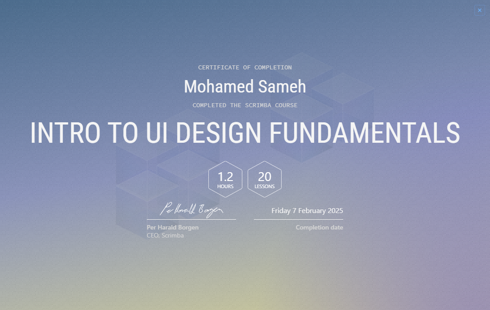

# 📃 About This Repository:

Welcome to the foundational projects repository for Scrimba! This repository serves as a collection of all the hands-on projects completed during various Scrimba courses, providing a comprehensive showcase of the skills and knowledge gained throughout the learning journey. Each project is neatly organized into its own folder, with the folder name reflecting the specific course it was derived from. Whether you're revisiting completed projects, exploring new courses, or seeking inspiration for your own coding journey, this repository aims to be a well-structured and easily navigable resource for all things Scrimba-related.

## 🚁 Learn HTML & CSS (✅ Completed on 23rd January, 2025): 

Started on the 20th of December, this course was taken to brush up on the fundamentals of HTML and CSS, serving as a strong foundation for more advanced learning. By revisiting essential concepts, the goal was to ensure a solid grasp of these core web technologies, paving the way for a smoother transition into the Learn JavaScript course. This journey represents an important step toward mastering front-end development and eventually learning React, which will enable the creation of dynamic, modern web interfaces. While the primary focus is on web development, there is also a possibility of branching into app development in the future.

## Certificate

## 🧠 Learn JavaScript (✅ Completed on 29th January, 2025):

Started on the 24th of January, this course introduces fundamental programming concepts like conditionals, loops, methods, and object-oriented programming (OOP). This course is an exciting step in learning JavaScript, focusing on problem-solving, bug fixing, and foundational techniques for building dynamic applications. Progress includes completing several interactive projects, such as a password generator, Blackjack game, and randomized emoji picker. These projects not only solidify understanding of core JavaScript concepts but also emphasize practical application, helping to build confidence in coding independently. As the journey unfolds, this course aims to lay the groundwork for becoming proficient in JavaScript, with the ultimate goal of transitioning to more advanced frameworks like React and beyond. 🚀

## Certificate

## 🧑‍🏫 Learn Accessible Web Development (✅ Completed on 7th Feb, 2025):
This course focused on making websites accessible to all users, ensuring that websites can be used by people with disabilities. Topics covered include keyboard navigation, screen reader compatibility, and designing with accessibility in mind. By completing this course, I gained a deeper understanding of how to create websites that are inclusive and provide an equal experience to all users, regardless of their abilities.

## Certificate

## 🧪 Intro to UI Design Fundementals (✅ Completed on 7th July, 2025):
Earned on the 7th of July, this course covered seven essential principles that form the foundation of effective user interface design: white space (strategic use of empty space to create breathing room and guide user attention), color (understanding color theory and psychology in digital interfaces), contrast (creating sufficient visual distinction for readability and accessibility), scale (using size relationships to establish hierarchy and emphasis), alignment (organizing elements in a structured manner to create visual order), typography (selecting and implementing fonts effectively for both aesthetics and user experience), and visual hierarchy (structuring information to guide users through content in order of importance). These seven fundamentals work together to create cohesive, user-friendly interfaces that are both functional and visually appealing.

## Certificate
 

## ⚙️ Advanced JavaScript (✅ Completed on 29th July, 2025):
Completed on the 29th of July, this course offered a deep dive into core and advanced JavaScript concepts critical for writing clean, efficient, and scalable code. It began with an expanded understanding of array methods such as .map(), .forEach(), and others, alongside refined use of object destructuring to simplify code structure. The course also clarified distinctions between function expressions, inline functions, and arrow functions - especially how they influence the this keyword in different contexts - and introduced default parameters and fallback patterns to write more defensive code.

A significant focus was placed on asynchronous JavaScript, explaining how to overcome callback hell using Promises and async/await syntax. Object-oriented programming principles were reinforced through the creation of custom objects using constructors and ES6 classes, including inheritance, polymorphism, and the use of private fields for encapsulation.

The course also introduced powerful intermediate concepts such as closures, Immediately Invoked Function Expressions (IIFEs), and functional techniques like currying, debouncing, and throttling. It concluded with a focus on generators and recursion, showcasing how these patterns can be used to solve complex problems elegantly and efficiently.

## 💻 Front-End Developer Career Path (🔃 In Progress):
Started on the 31st of January, this comprehensive program is designed to build a strong foundation in front-end development, covering HTML, CSS, JavaScript, React, UI/UX principles, accessible web development rules , and much much more. Through a hands-on, project-based approach, this course emphasizes real-world coding challenges, problem-solving, and best practices for modern web development with 31 total projects.

Progress includes completing multiple interactive, hand-on projects, such as responsive websites, interactive web apps, and dynamic UI components. These projects not only reinforce key front-end concepts but also provide practical experience in writing clean, maintainable code.

As the journey continues, the goal is to solidify front-end skills, create a polished portfolio, and gain the confidence to work on professional-grade applications. This path serves as a stepping stone toward becoming a well-rounded front-end developer, ready to dive into frameworks like React and beyond. 🚀

