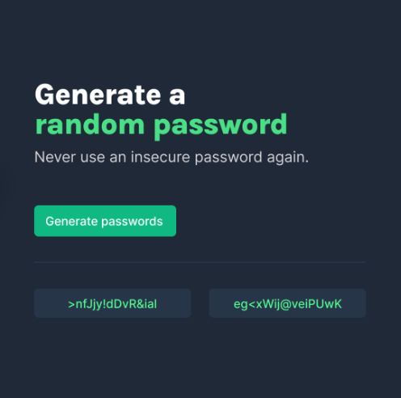

# 🔑 Random Password Generator

This project is a **Random Password Generator**, created as part of the "Learn JavaScript" course offered by **Scrimba**. It introduces foundational JavaScript concepts like randomization, array manipulation, DOM manipulation, conditionals, and styling with HTML and CSS.

---

## Features

- **Random Password Generation**: Generate two secure, random passwords with a fixed length of 15 characters.
- **Dynamic Interface**: Displays the generated passwords on the web page using JavaScript and DOM manipulation.
- **Stylish UI**: Clean and modern design with subtle effects and responsiveness.
- **Array and Math Usage**: Utilizes JavaScript arrays, `Math.random()`, and `Math.floor()` for password generation.

---

## Technologies Used

- **HTML**: For structuring the web page.
- **CSS**: For styling the user interface.
- **JavaScript**: For functionality, including random password generation and DOM manipulation.

---

## How It Works

1. **Password Generation Logic**:
   - The app uses a predefined array of characters (letters, numbers, and symbols).
   - A `for` loop generates two random passwords of 15 characters each by selecting random indices from the array.
2. **UI Updates**:
   - Generated passwords are displayed in two separate containers (`<div>` elements) dynamically using `textContent`.
3. **Styling**:
   - A visually appealing interface with styled buttons, containers, and a subtle horizontal line below the button.

---

## Installation and Usage

1. Clone the repository:
   ```bash
   git clone https://github.com/your-username/random-password-generator.git
   ```
2. Open `index.html` in your browser to run the app.

---

## File Structure

```
.
├── index.html    # Main HTML file
├── index.css     # CSS styling
├── index.js      # JavaScript functionality
└── README.md     # Project documentation
```

---

## Preview



The app features:
- **Header**: Title and description.
- **Button**: A clickable button to generate passwords.
- **Output Containers**: Two containers to display the generated passwords.


---

## Code Snippets

### Password Generation Logic:
```javascript
const characters = [
  "A", "B", "C", "D", "E", "F", "G", "H", "I", "J", "K", "L", "M",
  "N", "O", "P", "Q", "R", "S", "T", "U", "V", "W", "X", "Y", "Z", "a", "b", "c", "d", "e", "f", "g", "h", "i", "j", "k", "l", "m",
  "n", "o", "p", "q", "r", "s", "t", "u", "v", "w", "x", "y", "z", "0", "1", "2", "3", "4", "5", "6", "7", "8", "9", "~",
  "`", "!", "@", "#", "$", "%", "^", "&", "*", "(", ")", "_", "-", "+", "=", "{", "[", "}", "]", ",", "|", ":", ";", "<", ">", ".", "?",
  "/"
];

function generatePasswords() {
  let password1 = "";
  let password2 = "";

  for (let i = 0; i < 15; i++) {
    let randomIndex1 = Math.floor(Math.random() * characters.length);
    let randomIndex2 = Math.floor(Math.random() * characters.length);

    password1 += characters[randomIndex1];
    password2 += characters[randomIndex2];
  }

  document.getElementById("paragraph-el").textContent = password1;
  document.getElementById("paragraph-el2").textContent = password2;
}
```


---

## Credits

- Developed during the **"Learn JavaScript"** course by **Scrimba**.
- Icons and emojis used for creative presentation.

---

## License

This project is licensed under the MIT License. Feel free to use, modify, and distribute it as needed.

---

## Feedback

If you have any suggestions or encounter issues, feel free to open an issue in the repository or reach out at your-email@example.com.

