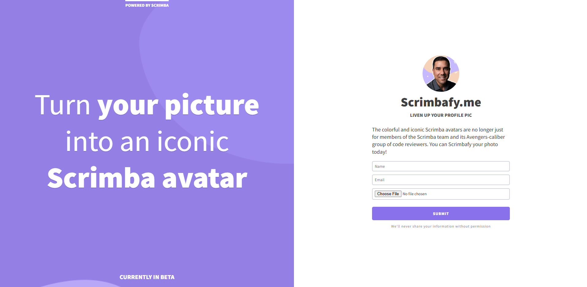

# Responsive Splash Screen

A sleek and modern responsive splash screen built using HTML and CSS, demonstrating best practices in responsive web design.

## 📸 Screenshot



## 🚀 Features
- **Mobile-First Design**: Uses media queries to adapt the layout based on screen size.
- **Flexible Units**: Implements percentages, `em`, and `rem` for scalable typography and layout.
- **Advanced Flexbox Usage**: Utilizes `flex-wrap`, `gap`, and `order` to manage content alignment and positioning.
- **Consistent Box Model**: Applies `box-sizing: border-box;` for predictable spacing.
- **Optimized Forms**: Styles form elements for better usability and appearance.

## 📱 Technologies Used
- **HTML5**
- **CSS3**
- **Flexbox & Responsive Design**

## 🎨 Key Concepts Covered
### ✅ Viewport Units
- Utilized `vw`, `vh`, `vmin`, and `vmax` to ensure fluid layout scaling.

### ✅ Flexible Typography & Spacing
- Used `rem` and `em` to create scalable fonts and maintain proportional spacing.
- Combined with percentages for dynamic layouts.

### ✅ Media Queries & Mobile-First Approach
- Designed with a **mobile-first** strategy, ensuring better performance on smaller screens before scaling up.
- Example:
  ```css
  @media (min-width: 768px) {
      .container {
          max-width: 90%;
      }
  }
  ```

### ✅ Flexbox Enhancements
- Implemented `flex-wrap` and `gap` to enhance layout adaptability.
- Adjusted `order` property to change element positioning based on screen size.
- Example:
  ```css
  .nav-links {
      display: flex;
      flex-wrap: wrap;
      gap: 10px;
  }
  ```

### ✅ Text Styling
- Applied `text-transform` for consistent text capitalization.
  ```css
  h1 {
      text-transform: uppercase;
  }
  ```

### ✅ Form Styling
- Enhanced form inputs and buttons for improved aesthetics and usability.
- Example:
  ```css
  input, button {
      padding: 10px;
      border-radius: 5px;
      border: 1px solid #ccc;
  }
  ```


## 🔧 Installation & Usage
1. Clone the repository:
   ```sh
   git clone https://github.com/yourusername/responsive-splash-screen.git
   ```
2. Open `index.html` in your browser.

## 📜 License
This project is open-source and available under the [MIT License](LICENSE).

---
💡 *Feel free to contribute or suggest improvements!* 🚀

